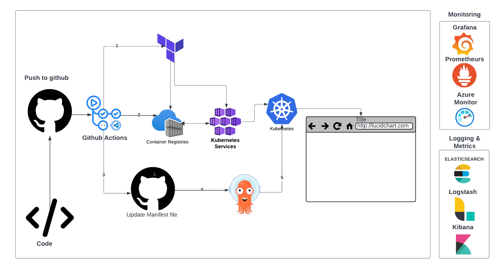
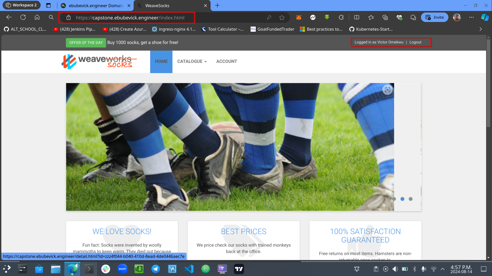

# Sock Shop, A Microservice Demo Application - Capstone Project:

The application acts as the user interface for an online store dedicated to selling socks. Its main goal is to showcase and test microservice and cloud-native technologies.

Built with Spring Boot, Go kit, and Node.js, the application is containerized using Docker and deployed on a Kubernetes cluster in Azure Kubernetes Service (AKS).

Note: To use Terraform to deploy infrastructure on your Azure subscription, make sure you have necessary permissions. Typically, you would need the Owner, Azure account administrator, or Azure co-administrator role on your Azure subscription. These roles provide the necessary permissions to create and manage resources.

## Visualizing the deployment pipeline

## Deployment steps

The [install folder](./prerequisitie-install/) contains scripts to install the needed cli tools

The [infrastructure folder](./tf-provision/) contains scripts to provision the infrastructure(aks,acr,VM).

The [.github folder]() contain the deployment scripts using github actions

The [monitoring]() contains the manifest file for monitoring, also see readme

The [logging]() contains the manifest file for logging

## Screenshot of application deployed

