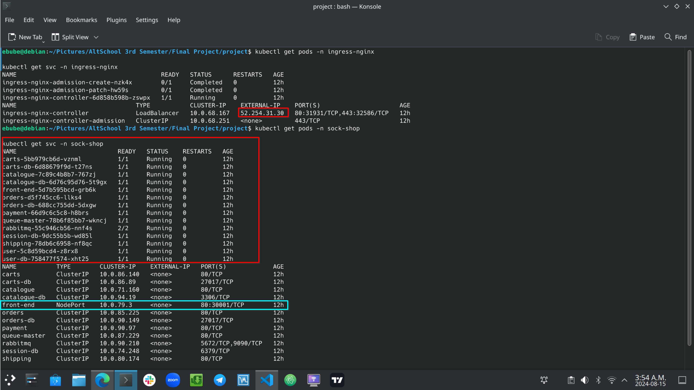

To Deploy the ingress, you need to 1st deploy the ingress controller

kubectl apply -f https://github.com/kubernetes/ingress-nginx/blob/main/deploy/static/provider/cloud/deploy.yaml

<!-- Check Ingress Controller Pod and Service -->

kubectl get all -n ingress-nginx

kubectl get svc -n ingress-nginx

After then you can deploy specific ingress, especially for cloud-specific clusters, eg eks,aks,do, visit [NGINX-INGRESS (environment specific)](https://kubernetes.github.io/ingress-nginx/deploy/#quick-start)

If using helm, visit [NGINX-INGRESS](https://kubernetes.github.io/ingress-nginx/deploy/#quick-start) and install an nginx ingress-controller 

## Screenshot of Ingress and Sock Shop Application Pod's and Svc's deployed with the External ip

